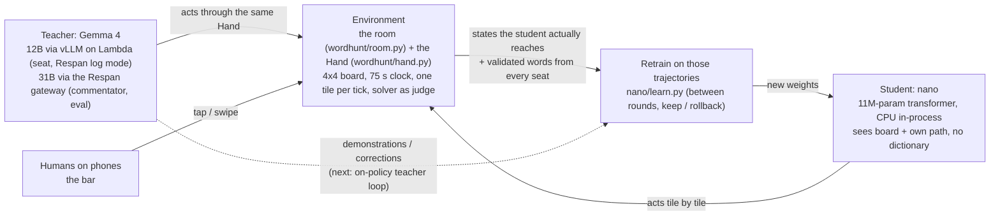
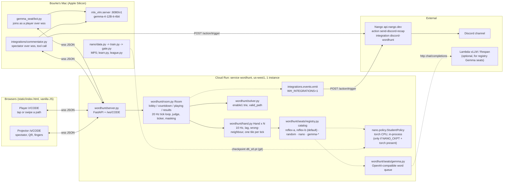
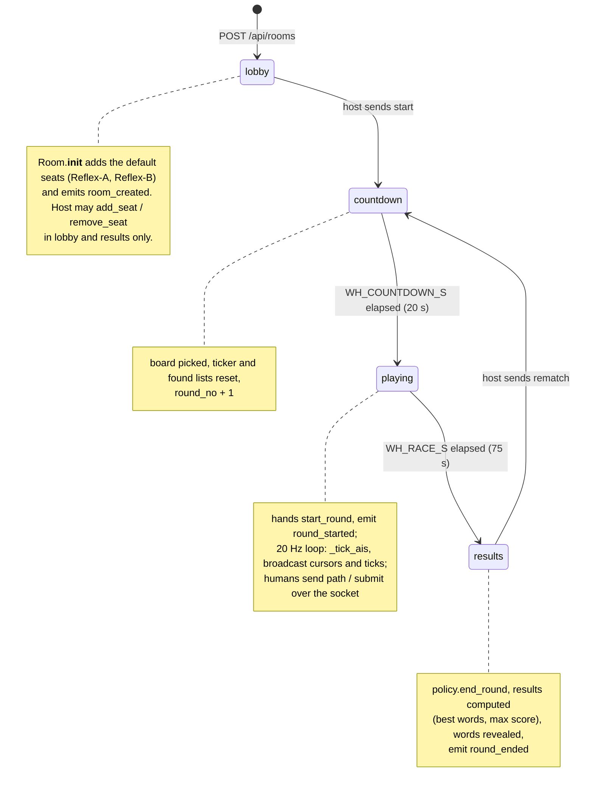
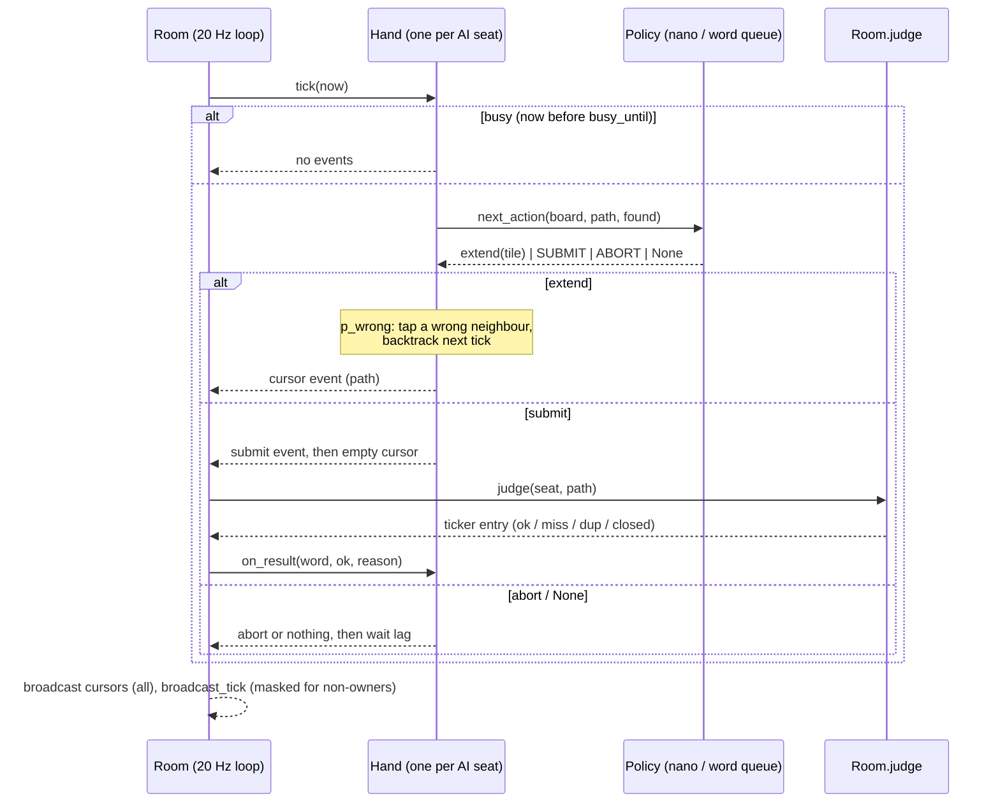
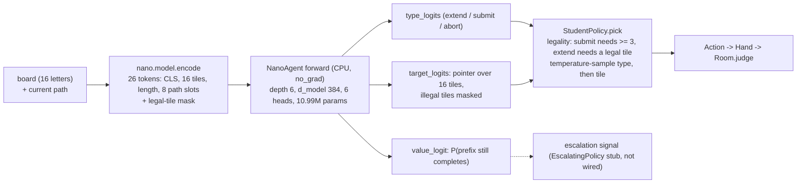
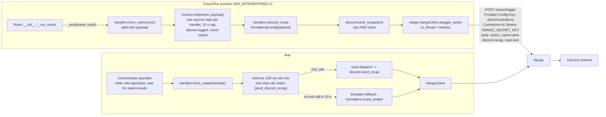
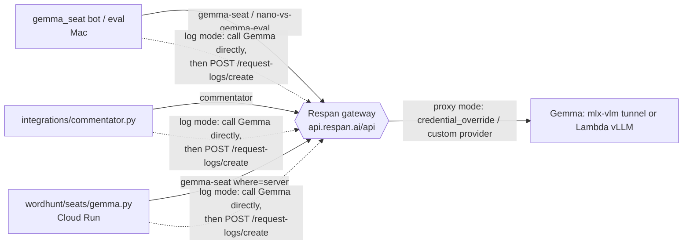
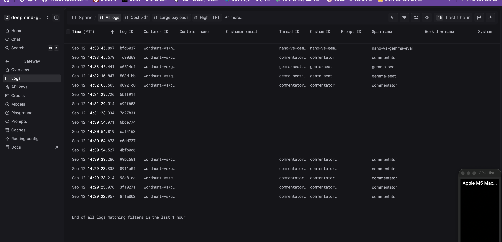

# Word Hunt arena: architecture

Everything built so far, as it is on `main` (read from the code on 2026-09-12, `0c781ac`). Where the code and the plan disagree, this doc follows the code and says so. Companion docs: [PLAN.md](../PLAN.md) (the pitch and decisions), [docs/league.md](league.md) (AI-only league table), [docs/talk-nano-slide.md](talk-nano-slide.md) (the three numbers for the talk), [docs/nanoagent-handoff.md](nanoagent-handoff.md) (prior work), [docs/gemma4-local-vision-findings.md](gemma4-local-vision-findings.md) (why mlx-vlm, not Ollama).

Contents: [Concept](#concept-frontier-teacher---tiny-policy) · [1. System overview](#1-system-overview) · [2. Game loop](#2-game-loop) · [3. Nano seat](#3-nano-seat) · [4. Gemma 12B seat](#4-gemma-12b-seat) · [5. Integrations](#5-integrations-nango--discord) · [6. Repo map, runbook, local vs cloud](#6-repo-map-runbook-local-vs-cloud) · [7. Known gaps](#7-known-gaps-and-discrepancies)

---

## Concept: frontier teacher -> tiny policy

**TL;DR:** On-policy distillation of frontier AI agents into tiny, task-specialized action models. Word Hunt VS (Humans vs AI) is the environment in which both ends of that loop run today. Same environment. Same actions. Same clock.



- **Environment** = the room and the hand: every seat, human or model, gets the same board, the same clock and the same physical action constraints (§2).
- **Student** = the nano seat (§3): an 11M-parameter policy that acts in the environment at ~20 ms per action with zero tokens.
- **Teacher** = Gemma 4: 12B served with vLLM on the Lambda A100 as a live seat, 31B via the Respan gateway for commentary and the nano-vs-Gemma eval (§4, §5b). Today Gemma is the frontier model operating in the same environment and the comparison; the same room with no humans is the eval harness ([docs/league.md](league.md)).
- **Honest status of the loop.** The shipped checkpoint (`d6_lambda.pt`) was trained from generated/self-solved trajectories (solver-annotated boards, §3 "Training pipeline"), not from a closed-loop on-policy teacher process. What exists today is both ends of the loop in one environment plus a measured between-round learner.
- **Next: on-policy teacher loop.** `nano/learn.py` (`OnlineLearner`, §3 "Live learner") already turns the words found by any seat, Gemma or human, into a 50-step CPU update with a held-out check and rollback. Closing the loop means: let the student act, hand the states it actually reaches to the teacher for demonstrations or corrections (the `EscalatingPolicy` stub in `nano/policy.py` is the escalation hook), retrain on those trajectories during the rematch countdown, repeat. Not wired into the live room yet (§7 item 8).

---

## 1. System overview

One FastAPI process, one WebSocket per client, rooms in memory, every AI seat driven tile by tile by a `Hand`. Cloud Run hosts the server; the Mac hosts Gemma (mlx-vlm), the Gemma bot, the commentator, and nano training.



Key facts (all from the code):

- **Server** `wordhunt/server.py`: `GET /`, `/r/{code}`, `/s/{code}` all serve `static/index.html`; `POST /api/rooms` creates a room with a 4-character code (alphabet `ABCDEFGHJKLMNPQRSTUVWXYZ23456789`); `GET /api/rooms/{code}` returns the snapshot; `GET /api/health` returns `{ok, words, rooms, build}`; `GET /api/build` returns the `WH_BUILD` label; `WS /ws/{code}` is the game socket. Rooms live in a module-level dict; rooms with no connected humans are garbage-collected after 3 h (`ROOM_TTL_S`), checked on room creation.
- **Client** `static/index.html`: one page, no build step. Identity is an anonymous `wh_pid` in `localStorage` plus an editable name. `/s/CODE` sets spectator mode (hello with `role: "spectator"`, no seat). Reconnects every 1.2 s on close. The projector QR is fetched from `api.qrserver.com` (external dependency).
- **WebSocket protocol** (client → server): `hello{player_id,name}` or `hello{role:"spectator"}`, `name`, `start`, `rematch`, `add_seat{spec_id}`, `remove_seat{seat_id}`, `path{path}`, `submit{path}`, `ping`. Server → client: `welcome`, `state` (full snapshot), `cursors` (fingers), `tick` (one ticker entry), `mine` (result of my submit, with `total`), `pong`, `error{fatal?}`.
- **Host**: the first connected human; `can_control()` is true for the host or for anyone once the host has disconnected. In the lobby a disconnecting human is removed and host passes to the next connected human.
- **Cloud Run** (`scripts/deploy.sh`, `scripts/promote.sh`): service `wordhunt`, region `us-west1`, `--min-instances 1 --max-instances 1 --session-affinity --timeout 3600 --cpu 1 --memory 512Mi`, `--allow-unauthenticated --no-invoker-iam-check` (org policy forbids `allUsers` IAM bindings). Each iteration is deployed as a **tagged revision** (`deploy.sh iter3` → tag `iter3`, URL `https://iter3---wordhunt-<hash>-uw.a.run.app`) with `--no-traffic` after the first deploy; `promote.sh <tag>` moves 100 % of the main URL to that tag. The image is built **without Docker or Cloud Build**: `crane append` puts a tar of `wordhunt/`, `static/`, `data/*.json`, the two word lists and pip wheels (`--platform manylinux2014_x86_64 --python-version 3.12`) on top of `python:3.12-slim`, then `crane mutate` sets `PYTHONPATH=/app/site` and the uvicorn CMD; pushed to Artifact Registry `us-west1-docker.pkg.dev/<project>/wordhunt/wordhunt:<tag>-<sha>`. `DEPLOY_MODE=source` uses the `Dockerfile` via Cloud Build instead. `WH_BUILD="<tag> · <sha>"` is baked into the revision env and shown in the page footer and `/api/health`. Google's frontend reserves `/healthz`, hence `/api/health`. At the time of writing the main URL serves `iter2b · f12a38d`.
- **Seats** are either `human` (a WebSocket) or `ai` (a `Hand` around a `Policy`). The Mac-side Gemma bot joins **as a human seat** from the server's point of view (it sends a normal `hello`), so it counts toward `WH_MAX_HUMANS` and carries no `label`.

---

## 2. Game loop

### Room states



State names in the code are `lobby | countdown | playing | results` (`Room.state`). One asyncio task per round (`_run_round`); `start()` cancels any previous task.

### Joining and the hot-join window

- Joining in `lobby`, `countdown` or `results` seats you now.
- Joining mid-race: `add_human` sets `seat.queued = self._late_for_this_round()`: play if fewer than `HOTJOIN_S` (env `WH_HOTJOIN_S`, default 15 s) of the race have elapsed, else queue the player for the next round (the client shows a banner and disables submit). (`HOTJOIN_S` was undefined between `383d976` and `6b1900d`; see [Known gaps](#7-known-gaps-and-discrepancies).) AI seats added mid-race are queued (`seat.queued = state == "playing"`) and skipped by the tick loop.
- Caps: `WH_MAX_HUMANS` (default 24) humans per room; `add_from_catalog` refuses when the room already has 8 seats of any kind.

### Boards

`Room._next_board()` pops from the room's shuffled copy of `data/boards.json` (10 packed boards, generated once by `python -m wordhunt.board`, best-of-40 live boards by total score), then falls back to `generate_board()` (random letters by `LETTER_WEIGHTS`, dead-board filter: ≥ 60 words and a 6+ letter word). The board is only present in `state` messages while `playing` or `results`.

### The Hand (`wordhunt/hand.py`)

Every AI seat is a `Hand(policy, HandProfile, rng)`. The room loop runs at 20 Hz (`period = 0.05`) and calls `hand.tick(now)` for every non-queued AI seat; the hand itself rate-limits with `busy_until`.



`HandProfile` fields: `hz` (default 10 → one tile per 100 ms), `lag` (0.15–0.30 s reaction before a word), `think` (pause after a submit), `p_wrong` (wrong neighbour then backtrack), `p_hesitate` (skip a tick mid-word). `start_round` also parks the hand for 0.5–1.5 s. Profiles in the registry:

| seat | hz | lag | think | p_wrong | p_hesitate |
|---|---:|---|---|---:|---:|
| Reflex-A (`reflex-a`) | 10 | 0.15–0.25 | 3–6 s | 0.06 | 0.04 |
| Reflex-B (`reflex-b`) | 8 | 0.20–0.30 | 5–9 s | 0.12 | 0.08 |
| Random (`random`) | 10 | 0.15–0.30 | 0.3–0.8 s | 0 | 0.05 |
| Nano (`nano`, `NANO_PROFILE`) | 10 | 0.15–0.30 | 0.4–1.0 s | 0 | 0.03 |
| Gemma registry seats (`GEMMA_PROFILE`) | 10 | 0.15–0.30 | 0.6–1.4 s | 0.05 | 0.04 |

### Policies (`wordhunt/seats/base.py`)

- `Policy.next_action(board, path, found) -> Action | None` is the tile-level contract (`extend(tile)`, `SUBMIT`, `ABORT`). `start_round(board, words)` receives the solver output; fair policies ignore it.
- `WordQueuePolicy` adapts word-level players: subclass supplies `next_word() -> path`, the base class emits one `extend` per tick, `SUBMIT` at the end, `ABORT` if the hand drifted off the target path. Used by `ReflexPolicy` (`seats/fake.py`, samples solver words with a frequency and length bias: Reflex-A short and common, Reflex-B longer and rarer) and `GemmaPolicy` (`seats/gemma.py`).
- `RandomSwiperPolicy` is the gate floor (random neighbour walk, submits at random length).
- Policies may expose `public_stats()`; the room puts it on the seat as `stats` (nano: `actions`, `latency_ms`, `tokens: 0`, `cost_usd: 0`; Gemma: `calls`, `errors`, `latency_ms`, `tokens`, `claimed`, `traceable`). The projector shows `latency_ms` and tokens next to AI seats.

### Judging, scoring, masking

- `Room.judge(seat, path)`: word = letters along the path; `solver.valid_path` checks 3–8 tiles, no repeats, adjacency, dictionary (enable1, 3–8 letters, ~80k words after filtering). Reasons: `miss`, `dup` (already in this seat's list), `closed` (round over or seat queued). Valid words go into the seat's private `found` dict and a ticker entry is appended (`TICKER_MAX = 60`, trimmed at 120).
- Scoring (`wordhunt/scoring.py`): 3 = 100, 4 = 400, 5 = 800, 6 = 1400, 7+ = 1800 (flat; the nano and gemma_seat evals add 400 per letter beyond 7, see gaps).
- Masking: until `results`, other seats' ticker words are shown as the first two letters plus underscores (`Room.mask_entry`, `ticker_for(seat_id)`, `broadcast_tick`); spectators see everything masked. In `results` the snapshot reveals every seat's `words` and `results[0] = {best_words[:12], n_board_words, max_score}`.
- Humans: `path` messages are rebroadcast as `cursors` so their finger shows on other screens; `submit` returns `mine{ok, word, delta, reason, total}`. The client supports tap-to-build (tap the last tile again to submit) and swipe (release submits).

### Seat registry (`wordhunt/seats/registry.py`)

`catalog()` is built once per process and returned in every snapshot so the lobby's "Add seat" dropdown lists available specs. `SeatSpec(id, name, label, make, available, default)`:

| id | name / label | policy | available when | default |
|---|---|---|---|---|
| `reflex-a`, `reflex-b` | Reflex-A / Reflex-B · `heuristic` | `ReflexPolicy` over solver words | always | yes (every new room gets both) |
| `random` | Random · `random swiper` | `RandomSwiperPolicy` | always | no |
| `nano` | Nano · `nano 10M · CPU` | `NanoPolicy(StudentPolicy)` | `NANO_CKPT` points at an existing file **and** `torch` **and** `nano.policy` import | no |
| `gemma-<model>` or ids from `GEMMA_SEATS` | model short name · `gemma · text grid` | `GemmaPolicy` | `GEMMA_SEATS` (JSON list) or `GEMMA_BASE_URL` + `GEMMA_MODELS` set | no |

Seat ids are `ai:<spec>`; a second copy becomes `ai:<spec>-2` and `Nano 2`. Each `add_from_catalog` calls `spec.make(solver, rng)` → a fresh policy per seat.

### Environment knobs

| var | default | read in | meaning |
|---|---|---|---|
| `WH_COUNTDOWN_S` | 20 | `room.py` | countdown length |
| `WH_RACE_S` | 75 | `room.py` | race length |
| `WH_MAX_HUMANS` | 24 | `room.py` | human seats per room |
| `WH_INTEGRATIONS` | unset | `room.py` | `1` turns on `emit()` hooks |
| `WH_BUILD` | `dev` | `server.py` | build label (`deploy.sh` sets `<tag> · <sha>`) |
| `WH_DATA_DIR` | `<repo>/data` | `solver.py` | word lists and `boards.json` |
| `WH_PUBLIC_URL`, `WH_INTEGRATIONS_TIMEOUT_S` | see §5 | `integrations/config.py` | join link in Discord posts; per-request timeout |
| `NANO_CKPT`, `NANO_TEMPERATURE` | unset, 1.0 | `seats/nano.py`, `registry.py` | nano checkpoint path; sampling temperature |
| `GEMMA_SEATS` or `GEMMA_BASE_URL` + `GEMMA_MODELS` + `GEMMA_API_KEY` | unset | `seats/gemma.py` | server-side Gemma seats |
| `PORT` | 8080 | uvicorn CMD | Cloud Run port |

There are no `WH_NANO_*` variables; the nano's think pause is the hard-coded `NANO_PROFILE`.

---

## 3. Nano seat

### How it is hosted and how inference works

- **Design**: in-process CPU PyTorch inside the same container as the game server. No separate model server, no GPU, no HTTP hop. `wordhunt/seats/nano.py` imports `nano.model.NanoAgent` and `nano.policy.StudentPolicy` lazily; `load_student()` calls `NanoAgent.load(NANO_CKPT, map_location="cpu")` once per process and caches the model in a module dict keyed by path; every seat gets its own `StudentPolicy(model, cpu, temperature, seed)` (own numpy RNG, so two nanos on one board diverge). The model weights are shared across rooms and seats; policies are per seat.
- **Per tick**: the Hand calls `NanoPolicy.next_action(board, path, found)` → `StudentPolicy.act(board, tuple(path))` → one forward pass on a batch of 1 → `("extend", tile) | ("submit", -1) | ("abort", -1)` plus `{confidence, value, type_dist, target_dist}`. The adapter maps that to `Action.extend`, `SUBMIT`, `ABORT` and accumulates `actions` and wall-clock ms for `public_stats()`. It does not pass `found` to the model (see gaps: `nano/seat.py`'s `NanoSeat.next_action(board, path, found)` does zero out `submit` for already-found words, but the game adapter wraps `StudentPolicy` directly, so duplicates are judged `dup`).
- **Latency**: 1.9 ms per action single-threaded CPU in the gate run and 2.7 ms in the league run, both measured on the Mac (`nano/seat.py bench`). Not yet measured on the Cloud Run shape (1 vCPU, 512 MiB); at 10 Hz per seat this is far below the 100 ms tick.
- **What ships today**: the checkpoint `nano/checkpoints/d6_s0.pt` (44 MB, committed) is **not copied into the image** by either `Dockerfile` (copies `wordhunt`, `integrations`, `static`, `data/*.json`) or `scripts/deploy.sh` image mode (copies `wordhunt`, `static`, `data`), and `requirements.txt` has only `fastapi` and `uvicorn` (no `torch`, no `numpy`). So on a revision built from these scripts `nano_seat.available()` is `False` and the Nano row is hidden from the catalog. `deploy.sh` already forwards `NANO_CKPT` and `NANO_TEMPERATURE` env vars if set. `nano/README.md` lists the remaining steps: `pip install torch numpy` (CPU wheels) and `COPY nano ./nano`. Whether the live `iter2b` revision was built differently cannot be determined from the repo; check `catalog[].available` in `GET /api/rooms/{code}`.



### Model (`nano/model.py`)

- Tokens (fixed layout, `SEQ_LEN = 26`): `[CLS]`; 16 tile tokens = letter embedding + grid position (segment TILE); one path-length token (0–8); 8 path tokens = tile-index embedding + that tile's letter + step position (segment PATH), padded. Embeddings: `tok`, `seg` (4 segments), `pos`, `letter`.
- Body: pre-norm transformer, one dial `depth`; width = 64 × depth, heads = depth, MLP 4×. Depth 6 → d_model 384, **10,987,012 params** (`train_d6_s0.json`). Depth 4 ≈ 3.3 M.
- Heads read `[CLS]`: `type_logits` (B, 3), `target_logits` (B, 16) = dot(q(cls), k(h_tile)) / √d with non-adjacent or used tiles masked to −∞, `value_logit` (B,).
- Loss (`compute_loss`): soft cross-entropy on type and pointer (rows with all-zero targets skipped) + 0.5 × BCE on value. Checkpoint = `torch.save({"cfg", "state", "extra"})`.

### Training pipeline (`nano/data.py` → `nano/train.py`)

- Data: random boards drawn from the letter distribution of enable1 words; `annotate()` walks the trie over every prefix path and records (weight of the prefix as a word, {next tile: completion mass}); `word_weight = 1 / (1 + rank/3000)` from `common-30k.txt`, 0.01 for words not in the common list. Six word paths sampled per board by that posterior, prefixes deduped, one dead continuation mined next to a prefix with p = 0.3 (type = abort, value = 0); boards with < 15 words rejected. Output `.npz` with `board, path, plen, target, ptype, value, bid`.
- Train: AdamW (0.9, 0.95), wd 0.1, clip 1.0, cosine to 10 %, lr `3e-4 × (4/depth)^0.5`, fp32, no AMP, batch 256, whole dataset pre-tokenised onto the device; `--budget-min` stops the cosine on wall clock; `--init` warm-starts. Device from `nano/device.py` (`make check-mps` refuses a silent CPU fallback on Apple Silicon).
- The shipped checkpoint `d6_s0`: 200k boards → 4.96 M training samples, 17,278 steps × 256 in a 30-minute budget on **MPS on the Mac** (2,457 samples/s), loss 2.61 → 1.07, val `type_top1 0.935`, `target_top1 0.767`, `value_acc 0.964`.
- Make targets: `make words`, `make data` (`BOARDS=200000`), `make train` (`DEPTH=6 STEPS=20000`), `make data-smoke` / `train-smoke` / `rollout-smoke`.
- Lab notebook (figures for architecture, training curve, inference latency, sample trajectories, gate/league, live learning): `nano/lab_notebook.ipynb`, rendered `nano/lab_notebook.html`. How to re-run: `nano/README.md`.

### Gate (`nano/gate.py`, result `nano/results/gate_d6_s0.md`)

Pre-registered in PLAN.md §3: on 50 unseen boards (seed 20000, ≥ 15 words each, 600 actions per board), score ≥ 4× the random swiper and valid-submit rate above the Gemma E4B seat (proxy today: the 12B mlx-vlm text seat at 0.20). Result: **PASS**, 9,126 vs 952 per board (9.59×), valid rate 0.971, 38 words per board, mean length 3.44, longest `stokes`. `nano/rollout.py` is the same loop without the verdict; `nano/league.py` plays the 20 gemma_seat seed-0 boards and merges the recorded Gemma evals into `docs/league.md`.

### Live learner (`nano/learn.py`)

- `OnlineLearner(checkpoint)` loads the model, a solver (training side only), a replay set (20k samples from `data/wh_200000.npz` if present, else 400 generated boards) and a fixed 20-board held-out set (seed 30000, 300 actions each, batched rollout under common random numbers).
- `update(board, words)`: this round's validated words (plus the previous round's) → `info_from_words` → the same soft targets as `data.py` (no dead mining), blended 0.5/0.5 with the base model's own predictions (hinted self-distillation); 50 AdamW steps at lr 2e-5, batch 64 half new / half replay, 4 CPU threads; then replay the held-out set. **Rollback rule**: keep iff `held_out_after ≥ held_out_before × (1 − 0.03)`, else restore model and optimizer state. Returns `{kept, held_out_before/after, n_samples, loss_first/last, seconds, ...}`. `learner.seat` hands back a `NanoSeat` on the current weights; `learner.save(path)` records the update history in the checkpoint.
- Measured (`nano/results/live_learning_curve.md`, teacher = solver's top-15 common words ≥ 4 letters): 9.3–10.2 s per update on CPU (fits the 20 s countdown), 8/10 updates kept, recall of taught words on the round board 0.35 → 0.46, held-out 7160 → 7145 (flat). Honest claim: it learns the words it was just shown.
- **Wiring status**: not wired. Nothing under `wordhunt/` imports `nano.learn`; the room does not collect validated words for a learner, and the nano seat's cached model is never swapped. The intended hook (from `nano/README.md`) is: at `round_ended`, collect every seat's `found`, run `learner.update` in `asyncio.to_thread` during the rematch countdown, then point the seat at `learner.seat` / reload the cache. `EscalatingPolicy` (nano asks a teacher when `value < 0.2`) exists as a stub in `nano/policy.py`; the adapter counts `escalated` in `info` but the registry only ever builds a `StudentPolicy`.

### Lambda GPU training run (placeholder)

A GPU training run on Lambda is in progress at the time of writing; nothing from it is on `main` yet. When it lands, record here: data size and seed, depth/steps/batch, wall time and device, val metrics, gate result vs `d6_s0`, and whether it replaces `nano/checkpoints/d6_s0.pt` (and therefore what `NANO_CKPT` should point at).

---

## 4. Gemma 12B seat

Two different things exist and should not be confused:

| | Mac-side bot `gemma_seat/` | Registry seat `wordhunt/seats/gemma.py` |
|---|---|---|
| Runs | on the Mac next to mlx-vlm | inside the game server process |
| Joins the room as | a **human** seat over `wss` (`hello{player_id,name:"Gemma 12B"}`) | an `ai` seat from the catalog |
| Model endpoint | `MLXVLM_BASE_URL` (default `http://localhost:8080/v1`) | `GEMMA_BASE_URL` / `GEMMA_SEATS` (must be reachable **from Cloud Run**: Lambda vLLM, Respan; the Mac is not) |
| Hand | its own `Hand` in `bot.py` (10 Hz ± 25 % jitter, lag 0.15–0.30, wrong-neighbour 0.04) | the server `Hand` with `GEMMA_PROFILE` |
| Decoding | T = 0.2, `presence_penalty 0.8`, `repetition_penalty 1.15`, `reasoning_effort "none"` + `enable_thinking false`, max_tokens 400, stream cut after 4 duplicate lines | T = 0.7, max_tokens 200, `chat_template_kwargs.enable_thinking=false`, 10 words per call, ≤ 12 calls per round |
| Modalities | `text` (default), `image` (448 px render), `index` (tile paths, parked) | text grid only |
| Status | used in the recorded races and evals | code present; no evidence in the repo that it is configured on the live service |

### The Mac-side bot (`gemma_seat/`)

- `make mlxvlm-up` starts `mlx_vlm.server --model mlx-community/gemma-4-12B-it-4bit --port 8080` (Apple Silicon only; ~7.4 GB RSS). Never the Ollama `gemma4:*-mlx` tags: they drop the vision tower ([docs/gemma4-local-vision-findings.md](gemma4-local-vision-findings.md)).
- `make gemma-seat ROOM=CODE SERVER=https://<cloud-run-host>` runs `python -m gemma_seat.bot --room CODE --server ...`; `--server` accepts `ws://`, `wss://`, `http://`, `https://` (`ws_base()` rewrites https → wss). `--create-room --start --rounds 1` makes and hosts a room itself.
- Flow per round: on the first `state` with `playing` and a new board, convert the server clock to monotonic (`phase_ends_at − now`, minus `--safety-s 0.5`), start a thread that **streams** Gemma's lines into an asyncio queue (`GemmaSeatClient.stream_words`, so the finger starts on the first line), and let `Hand.play_word` swipe one word at a time (`path` messages per tile, `submit` at the end). When the list runs dry with > 3 s left it re-asks with the words already tried fed back, up to 8 calls.
- **Raw vs `--filter-solver`**: default is raw and dictionary-free at the seat: every distinct 3+ letter word is swiped, on a legal path when one exists, else on a best-effort "jumping" path (`boards.best_effort_path`) so the server judges it and the ticker shows the miss; only words whose letters are not on the board are dropped. `--filter-solver` is the comparison mode from the first live race: skip untraceable words and, if `data/enable1.txt` is present, non-dictionary words.
- Protocol is behind `ProtocolAdapter`; `WordhuntV1Adapter` matches the current server shapes.

### A/B findings (summary)

Full tables: [gemma_seat/results/eval_n20_seed0.md](../gemma_seat/results/eval_n20_seed0.md), [eval_n20_seed0_ab.md](../gemma_seat/results/eval_n20_seed0_ab.md), [speculative_decoding_note.md](../gemma_seat/results/speculative_decoding_note.md), [gemma_seat/README.md](../gemma_seat/README.md), and the league in [docs/league.md](league.md).

| variant (20 boards, seed 0) | valid-word rate | valid words / call | score / board | latency / call |
|---|---:|---:|---:|---:|
| text grid, thinking off (default) | 20 % | 5.1 | 1,780 | 2.1 s |
| screenshot, thinking off | 22 % | 4.4 | 1,200 | 2.2 s |
| text + thinking on | 0 % | 0.0 | 0 | 30 s cap on 20/20 |
| tile-index prompt | ~0 legal paths | 0.1 | 25 | 15.5 s |

- The 12B knows words but cannot trace adjacency: ~80 % of its output is real English that is not on the board (364 "not on board" vs 44 "not a word" in the text run). Vision reads the tiles fine and lands in the same place.
- Thinking-on never answers inside a 75 s race (still enumerating tiles at 180 s uncapped); it is an inference-budget knob, not a match setting. Speculative decoding with the official MTP drafter gave 1.48× tokens/s, not 3×, and cost validity on the thinking-off seat (greedy loops). Decision: plain 12B, text grid, thinking off.
- Live races on a local server (75 s, text): `--filter-solver` 15/15 ok, 7,400; raw 18/65 ok (28 %), 6,800 and 39/101 ok (39 %), 15,500 (`gemma_seat/README.md`).
- League on the same boards: nano d6_s0 11,245 / valid 0.96 / 2.7 ms per action vs 12B text 1,780 / 0.20 / 2.1 s per call; random swiper 1,180.

---

## 5. Integrations: Nango → Discord



- **Hooks in the game** (`wordhunt/room.py` `_emit`): `room_created` (end of `Room.__init__`), `round_started` (right after `state = "playing"`), `round_ended` (after results are computed). Guarded by `INTEGRATIONS = os.environ.get("WH_INTEGRATIONS") == "1"`; the import of `integrations` happens inside the call and inside a `try/except`, so a missing package only logs a warning.
- **Events** (`integrations/events.py`): `on()`, `emit()`, `drain()`; handlers are `async (event_type, payload)`; each runs in its own task under `HANDLER_TIMEOUT_S = 15`; payloads are shallow-copied and get a `ts`. `emit` outside a running loop drops the event. Default handlers are installed lazily by `handlers.register()`.
- **Payload** (`handlers.from_room` / `from_snapshot`): `{code, round, url, seats:[{name, kind, label, score, n_words, words[:12], invalid, best_word, best_pts}], countdown_s, race_s, board_best, max_score, n_board_words}`. `invalid` counts `miss` ticker entries per seat.
- **Formatters** (`integrations/formatters.py`): Discord markdown with medals, thousands separators, seat kind icons, board stats, rematch CTA. Unit tests: `python -m integrations.test_formatters`. Every message names the room code because v1 posts to a single channel.
- **Transport** (`integrations/nango.py`, stdlib `urllib`): `POST /action/trigger` (synchronous; needs API-key scope `environment:actions:execute`), `GET /connections` (paged, filtered client-side), `/proxy/...` with `nango-proxy-*` headers (v2 threads, code present in `discord.py`, not wired). Dry-run whenever `NANGO_SECRET_KEY` is unset: requests are logged and recorded, nothing is sent.
- **Secrets and env** (`integrations/config.py`): `NANGO_SECRET_KEY` (required live; production copy lives in GCP Secret Manager as `nango-secret-key`, project `actionfleet-live` per `integrations/README.md`), `NANGO_CONNECTION_ID` (required live; find it with `python -m integrations.demo --connections`), `NANGO_DISCORD_INTEGRATION_ID` (default `discord-wordhunt`), `NANGO_DISCORD_RECAP_ACTION` (default `send-discord-recap`), `NANGO_BASE_URL` (default `https://api.nango.dev`), `WH_PUBLIC_URL` (join link; default `http://localhost:8000`), `WH_INTEGRATIONS_TIMEOUT_S` (default 8), `DISCORD_CHANNEL_ID` (v2 only). Note that `scripts/deploy.sh` does not forward any of these, does not set `WH_INTEGRATIONS`, and does not mount the secret (`--set-secrets`); the README describes the secret as mounted into the service, so that step is done outside the script.
- **Gemma commentator** (`integrations/commentator.py`, `integrations/tools.py`): the Nango-prize requirement is that the **model** calls the tool. `tools.TOOLS` exposes one OpenAI function, `send_discord_recap(text)`, mapped 1:1 to the Nango action. `commentate(payload)` makes one chat call (system prompt: 2–4 lines, name the room code, roast invalid words, mention the nano's parameter count; T = 0.7, max_tokens 300, `reasoning_effort "none"`, `enable_thinking false`, `tool_choice "auto"`), logs `MODEL CALLED NANGO TOOL ...` (the on-screen proof), dispatches the call, and falls back to the templated recap if there is no tool call within `GEMMA_TOOL_DEADLINE_S` (10 s) or the model answers in prose (logged as `posted templated recap instead`). Because Cloud Run cannot reach the Mac, it runs **client side**: `python -m integrations.commentator --room CODE --server https://<cloud-run-host>` joins as a spectator, waits for `state == "results"` with a new round number, builds the payload with `from_snapshot`, and fires. `--once` runs one call on the demo payload. Env: `GEMMA_BASE_URL` (default `http://localhost:8080/v1`), `GEMMA_MODEL`, `GEMMA_API_KEY`. With `WH_INTEGRATIONS=1` on the server, Discord gets both the server-side leaderboard and Gemma's trash talk; set `WH_INTEGRATIONS=0` if only the model should speak.
- **Demo without a game**: `python -m integrations.demo` (dry-run, three events), `--tool` (schema plus a fake dispatch), `--connections`, `--live` (one real post).

---

## 5b. Respan: traces for every Gemma call

[Respan](https://respan.ai) is an OpenAI-compatible AI gateway with tracing/evals. All Gemma
traffic in this repo goes through `integrations/respan.py` (stdlib only) and is off unless
`RESPAN_ENABLED=1` and `RESPAN_API_KEY` are set; with them unset every caller behaves exactly as
before.



**What is traced.** One span per chat call: model, prompt/completion, tokens, latency, status, plus
our tags — `span_name`/`custom_identifier` = caller (`gemma-seat`, `commentator`,
`nano-vs-gemma-eval`), `customer_identifier` = `wordhunt-vs/<caller>`, `thread_identifier` =
`<caller>:<room code | server-BOARD | seedN-nM-modality>`, `metadata` = app, trace, caller,
upstream_model, upstream_base_url, environment, host, build, where (`mac-bot` / `server` /
`commentator` / `eval`), board, modality, room, round, tool_called. Filter the Logs page by
Custom ID or any custom property; `/api/health` reports `respan: {enabled, mode, base_url}`.

**Env.** `RESPAN_ENABLED`, `RESPAN_API_KEY`, `RESPAN_BASE_URL` (default `https://api.respan.ai/api`),
`RESPAN_MODE` (`proxy` | `log`), `RESPAN_MODEL`, `RESPAN_CREDENTIAL_OVERRIDE`, `RESPAN_ENV`.
`scripts/deploy.sh` mounts Secret Manager `respan-api-key` as `RESPAN_API_KEY` and sets
`RESPAN_ENABLED=1`, `RESPAN_ENV=cloud-run` when the deploying SA can read the secret (same
pattern as `nango-secret-key`); `RESPAN_ENABLED=0` skips it.

**Two paths, and which one is live.**

| mode | how | when |
|---|---|---|
| `proxy` | request goes to `POST <RESPAN_BASE_URL>/chat/completions` with `Authorization: Bearer <RESPAN_API_KEY>`, the upstream Gemma model name (or `RESPAN_MODEL`), the tags above, and — when the upstream is not loopback — `credential_override: {model: {api_base, api_key}}` pointing at our endpoint. Respan also supports registering the endpoint once as a **custom provider + custom model** (Providers → Add Custom Provider; Models → create; or `POST /api/providers/`, `POST /api/models/`). | Lambda vLLM (public IP) or a tunnelled Mac. Verified 2026-09-12: gateway auth + tagging work and even failed attempts are logged as spans; a custom provider/model created via API (`wordhunt-gemma` / `gemma-4-12b-it`) was still answered `404 not available in the model list` by the gateway within the test window, so proxy mode to our own Gemma is **not yet confirmed end-to-end** — re-test after creating the provider/model in the UI (`scripts/respan_smoke.py --model gemma-4-12b-it`). |
| `log` | call Gemma directly (unchanged), then a daemon thread POSTs the finished call to `<RESPAN_BASE_URL>/request-logs/create/` with the same tags ("log without proxying" in Respan's custom-provider docs). | **This is the path that produced real traces today**: `scripts/respan_smoke.py --mode log` returned `201` with `unique_id`s for all three callers and they read back from `GET /api/request-logs/list/`. Works for Gemma on the Mac at `localhost:8080` (Respan's cloud cannot reach it) and needs no model registration. Set `RESPAN_MODE=log` on the Mac and on Cloud Run until proxy mode is confirmed. |



*Respan Logs (Bourke's dashboard, 2026-09-12 14:33 PT): one span per Gemma call, tagged per caller
(`Span name` / `Custom ID` = `nano-vs-gemma-eval`, `commentator`, `gemma-seat`; `Customer ID` =
`wordhunt-vs/<caller>`; `Thread ID` = caller:room). Sent via log mode. The untagged rows are the
proxy-mode probes the gateway rejected (401/404) — it logs failed attempts too.*

Span count per Custom ID from `GET /api/request-logs/list/` at 21:45 UTC: `gemma-seat` 2,
`commentator` 2 (+5 under per-run ids `commentator-<run>` from the proxy smoke), `nano-vs-gemma-eval` 1,
untagged gateway probes 7 — 17 spans total.

**Proxy-mode retry with the Lambda endpoint (2026-09-12 21:57-22:02 UTC).** Custom provider
`wordhunt-gemma` updated to `base_url=http://129.146.67.197:8000/v1` + the `gemma-lambda-api-key`
bearer, custom model `google/gemma-4-12B-it` created (both `201`, listed under the org's custom
models). The gateway still answers `404 Requested model … is not available in the model list` in
~0.4 s — before any upstream attempt — for `google/gemma-4-12B-it`, `gemma-4-12b-it`,
`wordhunt-gemma/…`, with and without `X-Respan-Route-Provider`, and 27+ minutes after creation,
so it is not a cache lag. `credential_override.api_base` on an OpenAI-family slug is ignored
(Respan tries OpenAI with our key → 401). API-created custom models are not resolvable by the
gateway; the docs describe the UI flow (Providers → Add Custom Provider, Models → create), which
may set a field the API does not — worth one try from the dashboard. Separately, the Lambda box
did not answer TCP on `:8000` from the internet during the window (needs the port open before
proxy mode can work at all). **Decision: log mode stays.**

Config for the Cloud Run Gemma seat (log mode, traces tagged `gemma-seat` / `where=server`):
`GEMMA_BASE_URL=http://129.146.67.197:8000/v1 GEMMA_MODELS=google/gemma-4-12B-it`
`GEMMA_API_KEY=<gemma-lambda-api-key> RESPAN_ENABLED=1 RESPAN_MODE=log RESPAN_API_KEY=<respan-api-key>`
(`deploy.sh` mounts `RESPAN_API_KEY` and sets `RESPAN_ENABLED=1`; export `RESPAN_MODE=log`).
Any caller string works as a tag without code changes (`respan.respan_params("gemma-12b-lambda", …)`
→ span `gemma-12b-lambda`, customer `wordhunt-vs/gemma-12b-lambda`); the registry seat itself is
hard-wired to `gemma-seat`, so a `gemma-12b-lambda` span name would be a one-word change in
`wordhunt/seats/gemma.py`.

**Hosted-Gemma proxy mode works (2026-09-12 22:02 UTC, after credits were added).** The
gateway hosts no Gemma 4 12B; the closest is the same-generation **Gemma 4 31B**
(`deepinfra/google/gemma-4-31B-it`, $0.13/$0.38 per 1M tokens; alternates
`together_ai/google/gemma-4-31B-it`, `openrouter/google/gemma-4-31b-it`; Gemma 3 12B exists as
`openrouter/google/gemma-3-12b-it`). Verified with a handful of calls: smoke → `200` in 0.7 s,
response headers `x-respan-log-id` / `x-respan-gateway-request-id`, span `ae4819c5…` on the Logs page
with `cost 0.00000954`, `customer_identifier wordhunt-vs/commentator`, `span_name commentator`; the real
commentator (`python -m integrations.commentator --once`) tool-called `send_discord_recap` through the
gateway in 4.7 s; the streaming eval client (`GemmaSeatClient`, presence/repetition penalties,
`enable_thinking=false`) returned 46 words in 10 s. The API-created custom provider path (our own
vLLM as a Respan model) still 404s — see the retry note above; ask Respan (frank@respan.ai) if
that matters later.

**The split (decision):**

| caller | route | why |
|---|---|---|
| Gemma 12B seat (`wordhunt/seats/gemma.py`, Mac bot `gemma_seat/bot.py`) | **our Lambda vLLM** (`GEMMA_BASE_URL=http://129.146.67.197:8000/v1`, `GEMMA_MODELS=google/gemma-4-12B-it`) in **`RESPAN_MODE=log`** | the Lambda rubric line: the seat must run on our GPU; log mode still puts every call on the Respan dashboard |
| commentator (`integrations/commentator.py`) and nano-vs-gemma eval (`gemma_seat/eval.py`) | **Respan gateway, `RESPAN_MODE=proxy`**, `RESPAN_MODEL=deepinfra/google/gemma-4-31B-it` | the Respan gateway line: real proxying with cost, latency, fallbacks; a hosted Gemma 4 is fine for commentary and for the A/B against nano |

Commentator env (Mac or wherever it runs; the game worker sets the same on the next tag if the
commentator moves server-side):
```
RESPAN_ENABLED=1 RESPAN_MODE=proxy RESPAN_API_KEY=<respan-api-key> RESPAN_MODEL=deepinfra/google/gemma-4-31B-it
# GEMMA_BASE_URL / GEMMA_API_KEY are ignored while proxying (Respan's credits pay the upstream);
# optional: RESPAN_BASE_URL=https://api.respan.ai/api (default)
python -m integrations.commentator --room CODE --server https://<host>
```
Eval: same four vars, then `python -m gemma_seat.eval …` → spans tagged `nano-vs-gemma-eval`.
Seat on Cloud Run: `RESPAN_MODE=log` plus the `GEMMA_*` vars above (log mode ignores `RESPAN_MODEL`).
Because one process holds one `RESPAN_MODE`, run the commentator as its own process (it already is).

**Respan CLI note.** `npx @respan/cli setup gateway` is an interactive wizard: it stores the key,
installs Respan skills/SDK docs for a coding agent and has that agent repoint the client — the
resulting shape is exactly what `integrations/respan.py` does (`base_url https://api.respan.ai/api`,
`Authorization: Bearer <RESPAN_API_KEY>`, `provider/model` slugs, tags via `extra_body`). `setup
tracing` installs the `respan` SDK (OpenTelemetry instrumentation → `/api/v2/traces`) or a local OTel
collector; our stdlib `POST /request-logs/create/` is Respan's documented no-SDK alternative and stays.

**Verification.** `python -m unittest integrations.test_respan` (17 tests, mock gateway: headers,
model, tags, override, disabled passthrough, both modes for all three callers);
`scripts/respan_smoke.py` fires one tagged request and prints the `unique_id` + Logs URL.

---

## 6. Repo map, runbook, local vs cloud

### Repo map

```
wordhunt/               game server (ships to Cloud Run)
  server.py             FastAPI app, routes, WebSocket handler, in-memory rooms
  room.py               Room: seats, states, tick loop, judge, ticker, masking, emit hooks
  hand.py               Hand + HandProfile: cadence cap and human-ish noise
  board.py              board generator, dead-board filter, packed boards, boards.json writer
  scoring.py            3=100 4=400 5=800 6=1400 7+=1800
  solver.py             enable1 trie DFS, valid_path, path_for_word, best_effort_path
  seats/base.py         Policy, WordQueuePolicy, RandomSwiperPolicy, Action
  seats/fake.py         Reflex-A / Reflex-B heuristic seats (default in every room)
  seats/gemma.py        OpenAI-compatible Gemma seat (server side) + env parsing
  seats/nano.py         NanoPolicy adapter around nano.policy.StudentPolicy, NANO_CKPT gate
  seats/registry.py     SeatSpec catalog, hand profiles
static/index.html       the whole client: home, lobby, countdown, play, results, spectator
nano/                   the hero model (Mac-side today)
  solver.py             nano's own trie solver (all paths per word, trie-node access)
  data.py               boards -> per-prefix soft targets (.npz)
  model.py              NanoAgent, encode(), compute_loss()
  train.py              trainer (fp32, AdamW, cosine, budget)
  policy.py             StudentPolicy, RandomSwiper, EscalatingPolicy (stub)
  seat.py               NanoSeat wrapper + bench (ms per action)
  rollout.py, gate.py   offline play and the pre-registered gate
  learn.py              OnlineLearner (live between-round learning) + simulate()
  league.py             writes docs/league.md / league.json / league.png
  device.py             MPS guard (make check-mps)
  checkpoints/d6_s0.pt  the shipped checkpoint (44 MB)
  results/              gate_d6_s0.*, train_d6_s0.json, live_learning_curve.*
  lab_notebook.ipynb    executable lab + plots; rendered lab_notebook.html
gemma_seat/             Gemma 12B bot and evals (Mac-side)
  client.py             GemmaSeatClient: prompts, streaming, image render, penalties
  bot.py                WebSocket bot, Hand, GemmaSeat (raw vs --filter-solver)
  eval.py               n-board eval, merge tables
  boards.py             its own solver/dictionary/packed_board (used by nano/league.py too)
  results/              eval_n20_seed0*.{md,json}, speculative_decoding_note.md
integrations/           Nango -> Discord (ships to Cloud Run via Dockerfile; also run on the Mac)
  config.py nango.py discord.py formatters.py events.py handlers.py tools.py commentator.py demo.py test_formatters.py
  respan.py test_respan.py   Respan gateway routing/tags for every Gemma call (§5b); scripts/respan_smoke.py fires one span
scripts/deploy.sh       tagged Cloud Run revision via crane; scripts/promote.sh moves traffic
Dockerfile              source-mode image (DEPLOY_MODE=source); word lists fetched at build
Makefile                setup, words, check-mps, data/train, mlxvlm-up/status/stop, gemma-seat
data/                   boards.json (10 packed boards, committed); enable1.txt, common-30k.txt (downloaded, gitignored)
docs/                   this file, league.*, talk-nano-slide.md, nanoagent-handoff.md, gemma4-local-vision-findings.md
PLAN.md, README.md      the plan, build order, checklists
```

Three solver implementations exist on purpose for now (`wordhunt/solver.py` returns one path per word for the game; `nano/solver.py` returns every path and exposes trie nodes for `data.py`; `gemma_seat/boards.py` is standalone so the bot does not import `wordhunt/`). Word lists: enable1 (validity) and `common-30k.txt` (frequency rank), see `data/README.md`.

### Runbook pointers

| task | command |
|---|---|
| word lists | `make words` (or the `curl` lines in `data/README.md`) |
| run the server locally | `uvicorn wordhunt.server:app --port 8000` (client at `http://localhost:8000`, room at `/r/CODE`, projector at `/s/CODE`) |
| enable the nano locally | `pip install torch numpy` then `NANO_CKPT=nano/checkpoints/d6_s0.pt uvicorn ...` (`NANO_TEMPERATURE=1.0`) |
| deploy a playtest build | `scripts/deploy.sh iter4` → prints the tag URL and curls `/api/health`; `REGION`, `SERVICE`, `REPO`, `DEPLOY_MODE`, `GCP_SA_KEY_JSON` env; forwards `GEMMA_*`, `NANO_CKPT`, `NANO_TEMPERATURE`, `WH_MAX_HUMANS` |
| promote to the demo link | `scripts/promote.sh iter4` |
| check what is live | `curl https://<host>/api/health` → `{"ok":true,"words":80272,"rooms":N,"build":"iter2b · f12a38d"}` |
| Gemma on the Mac | `make mlxvlm-up`, `make mlxvlm-status`, `make gemma-seat ROOM=CODE SERVER=https://<host>` (`SEAT_ARGS="--modality image --filter-solver --rounds 1"`) |
| commentator | `python -m integrations.commentator --room CODE --server https://<host>` (needs `NANGO_SECRET_KEY`, `NANGO_CONNECTION_ID`, mlx-vlm up) |
| integrations dry-run / tests | `python -m integrations.demo`, `python -m integrations.test_formatters` |
| nano train / gate / league | `make check-mps && make data && make train`; `python -m nano.gate --model nano/checkpoints/d6_s0.pt --out nano/results/gate_d6_s0.md`; `python -m nano.league --out docs/league.md` |
| live-learning simulation | `python -m nano.learn --checkpoint nano/checkpoints/d6_s0.pt --rounds 10 --out nano/results/live_learning_curve.md` |
| nano lab notebook | `nano/lab_notebook.ipynb` / `nano/lab_notebook.html`; re-render: `.venv/bin/python -m jupyter nbconvert --execute --to html --output lab_notebook.html nano/lab_notebook.ipynb` |
| Gemma evals | `python -m gemma_seat.eval --n 20 --seed 0 --json out.json`; `--merge a.json b.json` |

### What is local vs cloud

| piece | where it runs today | notes |
|---|---|---|
| Game server, rooms, Hand, Reflex/Random seats | Cloud Run (`wordhunt`, us-west1, 1 instance) | also runs locally with uvicorn |
| Static client | served by the same process | QR image from `api.qrserver.com` |
| Nano inference | designed for in-process CPU on Cloud Run; today only where `NANO_CKPT` + torch exist (local / Mac) | image scripts do not ship `nano/` or torch yet |
| Nano data, training, gate, league, learner sim | Mac (MPS) | Lambda GPU run in progress, not on `main` |
| Gemma 4 12B model | Mac, `mlx_vlm.server :8080` | Apple Silicon only |
| Gemma bot (`gemma_seat/bot.py`) | Mac → Cloud Run over wss | appears as a human seat |
| Registry Gemma seat (`seats/gemma.py`) | inside Cloud Run, needs an endpoint reachable from GCP | Lambda vLLM / Respan; not configured by anything in the repo |
| Server-side Discord events | Cloud Run process, `WH_INTEGRATIONS=1` | secret from Secret Manager `nango-secret-key` (mounted outside `deploy.sh`) |
| Gemma commentator | Mac → Cloud Run (spectator) + Nango | the model makes the tool call |
| Nango, Discord | SaaS | integration `discord-wordhunt`, action `send-discord-recap` |
| Word lists | fetched at image build / `make words` | not committed |

---

## 7. Known gaps and discrepancies

Things the code does that the plan or the README do not say, or that look unfinished. Flagged, not fixed, in this doc.

1. ~~**`HOTJOIN_S` is undefined**~~ Fixed on main (`6b1900d`): `HOTJOIN_S = float(os.environ.get("WH_HOTJOIN_S", 15.0))`. The live `iter3` build (`db06e46`) predates the fix; `iter3b` ships it. Mid-race join is now part of the Cloud Run check (`/tmp`-style script: join at 3 s → seated, join at 20 s → queued, socket kept).
2. ~~**Nano is not in the deployed image**~~ Since iter3: `Dockerfile` copies `nano/`, `requirements.txt` pulls CPU-only `torch`/`numpy` from the PyTorch CPU index, `deploy.sh` image mode ships `nano/` + manylinux_2_28 wheels, revision memory is 1 GiB. `Nano 10M` is the default lineup (`WH_SEATS` overrides); measured 19 ms/action on the 1 vCPU revision.
3. ~~**`deploy.sh` image mode does not copy `integrations/`**~~ Since iter3: the script copies `integrations/` when present, forwards `WH_INTEGRATIONS`, `WH_PUBLIC_URL`, `NANGO_*`, `DISCORD_CHANNEL_ID`, and mounts `nango-secret-key` as `NANGO_SECRET_KEY` by default when the secret is readable (warns and skips otherwise; `WH_INTEGRATIONS=0` disables). The revision runs as the deploying SA so the secret is accessible.
4. ~~**Nano adapter ignores `found`**~~ Since iter3: `wordhunt/seats/nano.py` wraps `NanoSeat.next_action(board, path, found)` and forwards `on_result`; the hand normalizes judged words to lowercase so the suppression matches (0 dups in a 6-board simulation, was 6 per round).
5. **Scoring differs for 8-letter words**: the game pays 1,800 flat for 7+; `nano/solver.py` and `gemma_seat/boards.py` pay 1,800 + 400 per extra letter. Eval scores and room scores are not byte-identical for 8-letter words.
6. **`GEMMA_BASE_URL` means two things**: a server-side registry seat endpoint in `wordhunt/seats/gemma.py` and the Mac-side commentator endpoint in `integrations/commentator.py`.
7. ~~**Seat cap counts humans**~~ Fixed: `add_from_catalog` now caps AI seats at 6 regardless of human count.
8. **Live learner and escalation are not wired** (§3). `EscalatingPolicy` has no teacher; the registry only builds `StudentPolicy`.
9. **Gemma bot is a human seat server-side**: no `label`, counts toward `WH_MAX_HUMANS`, and its words are masked like any player's. The Discord `round_ended` post therefore shows it with the human icon.
10. **PLAN.md says "no hot-join"**; the code implements a 15 s window (once item 1 is fixed). PLAN.md's default was tap-to-build; the client supports both tap and swipe.
