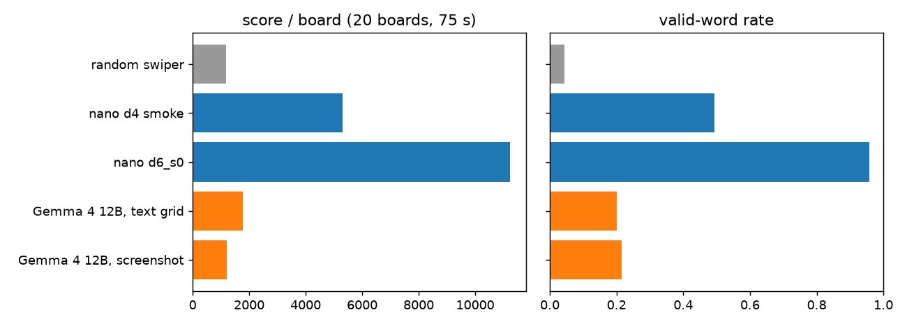

# AI-only league (PLAN.md section 6)

Same 20 boards as `gemma_seat.eval --n 20 --seed 0` (`gemma_seat/boards.py`, `packed_board`, seed 0). Nano and random seats play 750 actions = 75 s at the 10 Hz hand (temperature 1.0, CPU); Gemma numbers are the recorded one-call-per-board evals in `gemma_seat/results/` (not re-run). Words/min for Gemma assumes the same 10 Hz hand: one call's words traced at (len+1) ticks each, not-on-board words aborted after 3 ticks, and every call adding new words (optimistic: repeat calls overlap). $/match: everything ran on this Mac.

| seat | score / board | valid-word rate | mean word len | words / min (hand) | $ / match | latency | params | note |
|---|---:|---:|---:|---:|---|---|---|---|
| random swiper | 1180 | 0.04 | 3.30 | 4.5 | $0 | 0 ms | 0 | floor |
| nano d4 smoke (300 steps, 2k boards) | 5300 | 0.49 | 3.29 | 22.1 | $0 | 0.8 ms / action | 3.3M | smoke checkpoint |
| **nano d6_s0** (17k steps, 200k boards) | 11245 | 0.96 | 3.44 | 36.1 | $0 | 2.7 ms / action | 11.0M | the hero seat |
| Gemma 4 12B, text grid | 1780 | 0.20 | 3.79 | 27.7 | $0 (local mlx, Mac power) | 2.1 s / call (~26 words) | 12B (4-bit) | one call per board, T=0.2, thinking off |
| Gemma 4 12B, screenshot | 1200 | 0.22 | 3.57 | 28.5 | $0 (local mlx, Mac power) | 2.2 s / call (~20 words) | 12B (4-bit) | one call per board, T=0.2, thinking off |
| human (room, tonight) | | | | | $0 | reaction ~0.3 s | ~86B neurons | fill in from the room |

Gemma variants tried and parked (same boards):

| seat | score / board | valid-word rate | mean word len | words / min (hand) | $ / match | latency | params | note |
|---|---:|---:|---:|---:|---|---|---|---|
| Gemma 4 12B, tile-index prompt | 25 | 1.00 | 3.50 | 0.4 | $0 (local mlx, Mac power) | 15.5 s / call (~0 words) | 12B (4-bit) | index prompt: 15 s / call, ~0 words |
| Gemma 4 12B, text + thinking on | 0 | 0.00 | 0.00 | 0.0 | $0 (local mlx, Mac power) | 30.0 s / call (~0 words) | 12B (4-bit) | 20/20 calls hit the 30 s timeout |

## Reading it

1. The 11M nano scores 6.3x the 12B on the same boards with 1000x fewer parameters, deciding in 2.7 ms / action where the 12B needs 2.1 s per call; it is the only seat that plays at hand cadence without a word queue.
2. Valid-word rate is the honest split: nano 0.96, Gemma 12B 0.20 (text) - the 12B hallucinates words that are not on the board (18 of 26 per call); the nano only ever traces adjacent tiles.
3. Gemma finds longer words when it is right (mean length 3.79 vs 3.44); the nano's score is volume of 3-4 letter words (36 words/min), longest today `listen`.
4. Random swiper at 1180 is the floor; the nano is 9.5x it here (gate: >= 4x on 50 unseen boards passed at 9.6x, `nano/results/gate_d6_s0.md`).
5. Thinking-on and the tile-index prompt are parked for the match: thinking timed out on 20/20 boards at 30 s, the index prompt returned ~0 words at 15 s per call. Thinking is an inference-budget knob, not a match setting.

