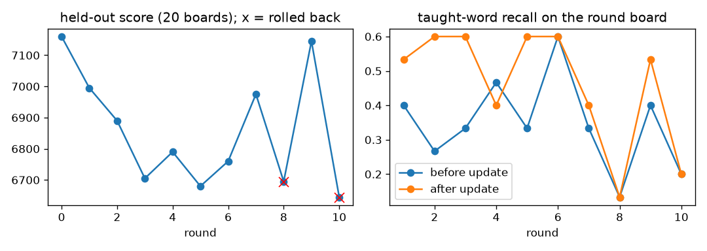

# Live learning curve: `nano/checkpoints/d6_s0.pt`, 10 AI-only rounds

Teacher stand-in for Gemma: the solver's top-15 common words of length >= 4 on each round board. Learner: 50 BC steps per round on CPU (4 threads), batch 64 mixed 1:1 with replay from the base data, lr 2e-05, the last 2 rounds' words stay in the new-sample pool, new-sample targets = 0.5 x base prediction + 0.5 x taught posterior (hinted self-distillation). Held-out: 20 fixed boards, 300 actions each, batched rollout with common random numbers; keep if held-out score >= before x (1 - 0.03).

| round | kept | held-out score | words/board | valid rate | taught | recall before -> after | update s (train s) |
|---:|---|---:|---:|---:|---:|---|---:|
| 0 | yes | 7160 | 30.0 | 0.976 | 0 |  | 6.2 |
| 1 | yes | 6995 | 29.6 | 0.970 | 15 | 0.40 -> 0.53 | 10.2 (6.0) |
| 2 | yes | 6890 | 29.3 | 0.971 | 15 | 0.27 -> 0.60 | 9.7 (5.4) |
| 3 | yes | 6705 | 28.2 | 0.960 | 15 | 0.33 -> 0.60 | 9.5 (5.3) |
| 4 | yes | 6790 | 27.9 | 0.960 | 15 | 0.47 -> 0.40 | 9.4 (5.2) |
| 5 | yes | 6680 | 27.1 | 0.945 | 15 | 0.33 -> 0.60 | 9.3 (5.2) |
| 6 | yes | 6760 | 28.8 | 0.950 | 15 | 0.60 -> 0.60 | 9.3 (5.2) |
| 7 | yes | 6975 | 28.7 | 0.957 | 15 | 0.33 -> 0.40 | 9.3 (5.2) |
| 8 | rollback | 6695 | 27.6 | 0.961 | 15 | 0.13 -> 0.13 | 9.5 (5.3) |
| 9 | yes | 7145 | 27.7 | 0.956 | 15 | 0.40 -> 0.53 | 9.7 (5.5) |
| 10 | rollback | 6645 | 26.9 | 0.948 | 15 | 0.20 -> 0.20 | 9.6 (5.4) |

Held-out score 7160 -> 7145 (-0.2%), 8/10 updates kept. Update wall time mean 9.5 s, max 10.2 s (budget: 20 s rematch countdown). Recall of taught words on the round board: mean 0.35 -> 0.46.

## Reading it

- Fits the countdown: 9.3-10.2 s per update on CPU (about 5.3 s of BC steps at ~100 ms/step for the 11M model at batch 64, plus one 20-board held-out rollout). The pre-update held-out score is cached from the previous round.
- Learns the taught words on the round board (recall 0.35 -> 0.46 mean; up to +0.33 in a round) while held-out stays flat within the seed noise of the held-out rollout (about +/-4% at 300 actions x 20 boards: seeds 1-3 read 5030-5220 at 200 actions on the base model). Ten rounds of 15 words is not enough signal to move a 200k-board prior on unseen boards; the honest on-stage claim is "it learns the words it was just shown", not "it gets better at Word Hunt in ten rounds".
- Ablation (same seeds, no self-distillation blend, lr 2e-5, 60 steps, last-4-round buffer): held-out 7160 -> 7475 (+4.4%) but only 2/10 updates kept (the other eight dropped held-out 3-8% and rolled back), recall 0.33 -> 0.39, 14.2 s mean / 18.7 s max per update. The kept rounds had recall jumps of +0.20 and +0.33. The blend trades that volatility for kept updates and a 9.5 s budget; `OnlineLearner(self_mix=0.0)` restores the ablation.
